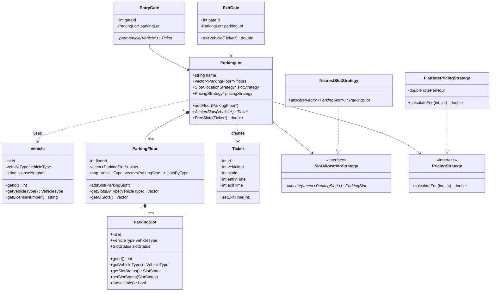

# Parking Lot — Low Level Design (C++)

A C++ implementation of a Parking Lot system using OOP principles and the Strategy design pattern.

---

## Entities

| Entity | Description |
|---|---|
| `Vehicle` | Represents a vehicle with an ID, license number, and type (CAR / BIKE) |
| `ParkingSlot` | A single parking spot on a floor; tied to a vehicle type and has a status (AVAILABLE, OCCUPIED, etc.) |
| `ParkingFloor` | A floor in the lot containing multiple slots; maintains a type-indexed map for fast slot lookup |
| `Ticket` | Issued on entry; holds vehicle ID, slot ID, entry time, and exit time |
| `ParkingLot` | Core service that manages floors, assigns slots, and calculates fees on exit |
| `EntryGate` | Entry point — takes a vehicle and returns a ticket |
| `ExitGate` | Exit point — takes a ticket, frees the slot, and returns the fee |

## Strategies

| Strategy | Description |
|---|---|
| `SlotAllocationStrategy` | Abstract interface for slot selection |
| `NearestSlotStrategy` | Returns the first available slot (concrete implementation) |
| `PricingStrategy` | Abstract interface for fee calculation |
| `FlatRatePricingStrategy` | Charges a fixed rate per hour (concrete implementation) |

---

## UML Class Diagram



---

## How to Run

```bash
g++ -std=c++17 main.cpp services/ParkingLot.cpp -o parking_lot && ./parking_lot
```

## Project Structure

```
Parking-Lot/
├── enums/
│   ├── VehicleType.h
│   └── SlotStatus.h
├── models/
│   ├── Vehicle.h
│   ├── ParkingSlot.h
│   ├── ParkingFloor.h
│   └── Ticket.h
├── strategies/
│   ├── PricingStratery.h
│   ├── FlatRatePricingStrategy.h
│   ├── SlotAllocationStratergy.h
│   └── NearestSlotStrategy.h
├── services/
│   ├── ParkingLot.h
│   └── ParkingLot.cpp
├── gates/
│   ├── EntryGate.h
│   └── ExitGate.h
└── main.cpp
```
